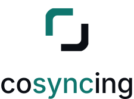
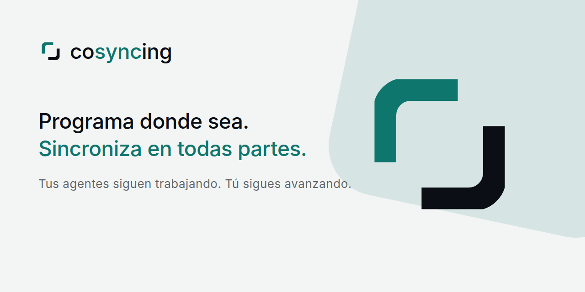
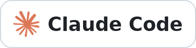
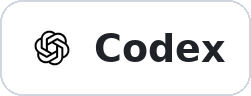
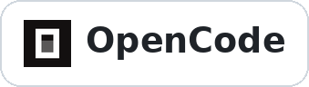

<p align="center">
  <picture>
    <source media="(prefers-color-scheme: dark)"
            srcset="apps/client/assets/brand/source/cosyncing-lockup-stacked-reverse.svg">
    
  </picture>
</p>

<p align="center"><b>Del CLI a la interfaz gráfica, en directo y sincronizado</b></p>

<p align="center">
  <a href="https://cosyncing.com/es/#sync">
    <picture>
      <source media="(prefers-color-scheme: dark)"
              srcset="https://cosyncing.com/assets/sync/sync-demo-dark.gif">
      
    </picture>
  </a>
</p>

<p align="center">
  <picture>
    <source media="(prefers-color-scheme: dark)"
            srcset="apps/client/assets/brand/marketing/social-banner-es-1280x640.png">
    
  </picture>
</p>

<p align="center">
  <a href="https://cosyncing.com/es/">Sitio web</a> ·
  <a href="#instalación">Instalación</a> ·
  <a href="#cliente">Cliente</a> ·
  <a href="docs/README.md">Documentación</a> ·
  <a href="docs/CONTRIBUTING.md">Contribuir</a> ·
  <a href="README.md">English</a> ·
  <a href="README.zh-CN.md">简体中文</a> ·
  <a href="README.ja.md">日本語</a> ·
  <a href="README.ko.md">한국어</a>
</p>

---

Sincroniza y controla tus agentes: del CLI a la interfaz gráfica, del escritorio al móvil. Retoma el
trabajo justo donde lo dejaste, estés donde estés. cosyncing mantiene tus agentes de programación
sincronizados dentro de tu propia red.

El broker se ejecuta en la máquina donde trabajan tus agentes. Observa sus sesiones y sirve un
cliente que las muestra todas, agrupadas por proyecto, con su transcripción, sus diferencias, sus
comandos y cualquier pregunta que esté esperando por ti. Puedes leer una sesión, responder una
pregunta o tomar el control. No hay que crear ninguna cuenta ni hay ningún servicio alojado entre el
cliente y el broker.

## Agentes compatibles

<p>
  <a href="https://www.claude.com/product/claude-code" title="Claude Code"></a>
  <a href="https://openai.com/codex/" title="Codex"></a>
  <a href="https://opencode.ai/" title="OpenCode"></a>
  <a href="https://pi.dev/" title="Pi"></a>
  <a href="https://www.kimi.com/code" title="Kimi CLI"></a>
  <a href="https://github.com/deepseek-ai/deepseek-harness" title="DeepSeek Harness"></a>
</p>

Un solo protocolo cubre los seis. Lo que puedes controlar cambia según el agente, y las sesiones de
Claude Code se abren en solo lectura hasta que tomas el control. Consulta la
[configuración de agentes compatibles](docs/supported_agents/README.md) para versiones e instalación,
y el [soporte de adaptadores](docs/protocol/adapter-support.md) para la tabla de capacidades.

Los clientes en primer plano pueden unirse a la misma sesión de Codex o Pi que controla el broker sin
lanzar un segundo Resume nativo. Claude Code mantiene su flujo de Observar/Tomar el control en otro
cliente, y OpenCode mantiene su comportamiento compartido en vivo. Las conexiones de observación en
segundo plano siguen siendo de solo lectura.

**Experimental:** hay dos adaptadores provisionales para quienes trabajan desde el código fuente;
ambos hablan con un servidor local en lugar de con un CLI. [Kimi Code](docs/supported_agents/kimi.md)
observa en solo lectura todas las sesiones de un servidor `kimi web`, controla las que creó cosyncing
—mensajes, aprobaciones, elección de modelo— y toma el control de las demás de forma explícita.
[DeepSeek Harness](docs/supported_agents/dsh.md) se conecta a un host `dsh web` y da a los clientes
activos en primer plano una transcripción compartida y una superficie de control, con elección de
modelo y de esfuerzo de razonamiento, ajustes de permisos, los propios comandos de barra del host y
adjuntos de imagen. No admite adjuntos de archivo genéricos —el host solo acepta imágenes— y las
suscripciones residentes en segundo plano y parte de la presentación de mensajes quedan pendientes.

Ninguno necesita un indicador de despliegue ni una terminal abierta: un servicio cosyncing instalado
arranca un host si no hay ninguno en marcha, reinicia el que se cae y detiene solo el que él mismo
inició. Un host que hayas arrancado tú nunca se detiene, se sustituye ni se reconfigura, y la
configuración nombra ambos hosts antes de que aceptes gestionarlos. Instala DeepSeek Harness de forma
global con `npm install -g @deepseek-ai/dsh`: cosyncing busca `dsh` en tu PATH, así que con una
instalación solo por `npx` puede comunicarse con él, pero nunca arrancarlo ni comprobar su versión.
Consulta la [configuración de agentes compatibles](docs/supported_agents/README.md) para ambos hosts.

## Requisitos previos

El servidor necesita [Bun](https://bun.sh) 1.3.8 o posterior para ejecutar cosyncing, y Node.js/npm
para instalarlo y actualizarlo. El broker es local por omisión. Para usarlo entre dispositivos hace
falta un proxy, un túnel, una VPN, una red mallada u otro
[método de conectividad gestionado por ti](docs/connectivity/README.md). Para una ruta privada
sencilla, mira [Tailscale Serve](docs/connectivity/tailscale-serve.md); para una red superpuesta que
gestiones tú, [WireGuard o EasyTier](docs/connectivity/wireguard-easytier.md). Después de
`cosyncing setup` también puedes pasarle
`https://github.com/cosyncing/cosyncing/tree/main/docs/connectivity` a un agente de programación y
pedirle que configure el método que elijas manteniendo el broker atado a loopback.
[Tokdash](https://github.com/JingbiaoMei/tokdash) es opcional, pero muy recomendable para seguir el
consumo y recibir avisos.

Consulta los [requisitos de instalación](docs/installation/prerequisites.md) para los comandos de
Linux y macOS, las notas de WSL y la configuración de Tokdash.

## Instalación

El paquete contiene un único paquete de aplicación JavaScript y el cliente web. Los hosts de broker
admitidos son Linux x64, Linux arm64 y macOS con Apple Silicon; en Windows, ejecuta el broker dentro
de WSL.

Antes de configurar, instala solo los agentes que uses; consulta
[configuración de agentes y comprobación del PATH](docs/supported_agents/README.md#preflight).

Instala la versión actual:

```bash
npm install --global cosyncing
```

Abre una nueva sesión de shell y configura el servicio:

```bash
cosyncing setup

# Tras la configuración, usa cosy como abreviatura de cosyncing
cosy restart
cosy doctor
cosy status
cosy pair
```

`setup` inspecciona la máquina, muestra exactamente qué va a cambiar y aplica el plan entero o nada.
Copia el broker en `~/.cosyncing/bin/cosyncing`, instala un servicio de usuario que ejecuta esa copia
con tu Bun e imprime la URL de tu broker. El broker se niega a arrancar hasta que la configuración se
haya confirmado.

Para actualizar, deja que npm sustituya el paquete global y vuelve a ejecutar setup, para que
cosyncing copie la nueva aplicación en su servicio gestionado y ponga la instalación al día:

```bash
npm update --global cosyncing
cosy setup
```

`cosy update` informa de esta vía de actualización, que pertenece al gestor de paquetes; no ejecuta
npm ni modifica el paquete global.

`cosy pair --broker-url https://cosy.example.com` incluye ese origen accesible por el cliente en un
código QR de un solo uso válido cinco minutos. La URL no se guarda ni se comprueba. Omite el
parámetro si el cliente ya conoce la URL de su broker y solo quieres una oferta de autenticación.
Consulta el [selector de conectividad](docs/connectivity/README.md). Escanea el QR desde un cliente
para darle acceso; `cosy devices list` muestra los dispositivos emparejados y
`cosy devices revoke <id>` revoca uno.

Después de la configuración, `cosy doctor` diagnostica la máquina sin modificarla y `cosy status`
resume la instalación, el servicio, los agentes y las sesiones.

## Cliente

Tu propio broker sirve la aplicación web de Flutter incluida en `/cosy/`; no descarga código de
aplicación de un tercero en tiempo de ejecución. La configuración imprime la URL: ábrela en cualquier
navegador que pueda llegar al broker. Los clientes de Android y de escritorio están en
[GitHub Releases](https://github.com/cosyncing/cosyncing/releases/latest). El cliente de iOS llegará
más adelante por TestFlight.

<p align="center">
  <a href="https://cosyncing.com/es/demo/">
    <picture>
      <source media="(prefers-color-scheme: dark)"
              srcset="https://cosyncing.com/assets/shots/demo/real/dark/workspace.png">
      
    </picture>
    <picture>
      <source media="(prefers-color-scheme: dark)"
              srcset="https://cosyncing.com/assets/shots/demo/real/dark/sessions.png">
      
    </picture>
  </a>
</p>

**Servidor** — el broker se ejecuta en:

<p>
  
  
  
</p>

**Clientes** — el árbol de código y CI cubren seis plataformas:

<p>
  
  
  
  
  
  
</p>

Esta versión no admite alojar el servidor en Windows nativo ni en macOS con Intel. En Windows,
ejecuta el broker dentro de WSL, donde es un host Linux admitido. El software de conectividad que
reenvía el loopback del broker debe ejecutarse donde pueda alcanzar al broker de WSL; consulta las
guías de cada método.

## Privacidad y seguridad

El broker se ejecuta en tu máquina, con tu cuenta. Su estado se guarda ahí y el contenido de las
sesiones se envía solo a clientes autenticados, por la red que tú elijas. cosyncing no opera ningún
servicio alojado en esa ruta y no incluye telemetría de analítica ni de publicidad. Las funciones
opcionales contactan únicamente con los servicios que nombran, como los datos de consumo locales de
Tokdash. cosyncing no configura ni contacta con proveedores de conectividad: cualquier proxy, túnel,
VPN o red mallada es cosa tuya. El broker instalado por npm no se sustituye a sí mismo en silencio:
npm se encarga de actualizar el paquete y `cosy setup` pone al día el servicio instalado después de
una actualización.

Informa de las vulnerabilidades por el canal privado de GitHub, según [SECURITY.md](SECURITY.md).

## Estructura del repositorio

- `packages/typescript/` — broker, propietario del contrato de red, adaptadores de agentes,
  transporte y criptografía.
- `packages/dart/` — contrato del cliente, transporte, adaptador de Flutter y criptografía.
- `apps/client/` — la aplicación Flutter, con el lanzador de cada plataforma, la batería de pruebas,
  el controlador de integración y las herramientas de desarrollo.
- `contracts/generated/` — instantánea aplanada del contrato del cliente, propiedad del broker.
- `apps/poc-ui/` — interfaz de prueba de concepto, no destinada a producción, que se conserva para
  las pruebas deterministas del broker.

## Desarrollo

El repositorio fija Flutter 3.44.3 en `.fvmrc` y Bun 1.3.8 en `package.json`. Ejecuta los comandos
desde la raíz del repositorio.

```bash
bun install --frozen-lockfile
bun run client:pub-get
bun run typecheck
bun run client:analyze
bun run client:test
```

Regenera los contratos de cliente que pertenecen al broker con `bun run contract:generate`. CI
ejecuta `bun run contract:check` y falla si la instantánea está desactualizada.

Empieza por [docs/README.md](docs/README.md) y
[build and test](docs/development/build-test.md). Lee [CONTRIBUTING.md](docs/CONTRIBUTING.md) y
[CODE_OF_CONDUCT.md](docs/CODE_OF_CONDUCT.md) antes de proponer un cambio; las contribuciones usan
fork y pull request, y cada commit necesita la firma de `git commit -s`. Las preguntas de uso van a
GitHub Discussions y los fallos reproducibles a GitHub Issues; consulta
[SUPPORT.md](docs/SUPPORT.md). Las instalaciones que vienen de un cliente anterior empiezan desde
cero; consulta [local data and upgrades](docs/development/data-and-upgrades.md).
(La documentación para quienes contribuyen está por ahora solo en inglés.)

## Licencia

El código propio se publica bajo la licencia Apache 2.0. Consulta [LICENSE](LICENSE) y
[NOTICE](NOTICE).
