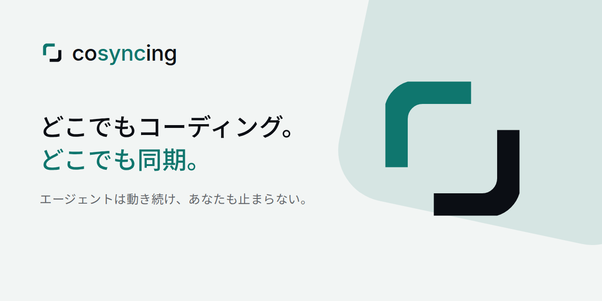

<p align="center">
  <picture>
    <source media="(prefers-color-scheme: dark)"
            srcset="apps/client/assets/brand/source/cosyncing-lockup-stacked-reverse.svg">
    
  </picture>
</p>

<p align="center"><b>CLI から GUI へ、リアルタイムで同期</b></p>

<p align="center">
  <a href="https://cosyncing.com/ja/#sync">
    <picture>
      <source media="(prefers-color-scheme: dark)"
              srcset="https://cosyncing.com/assets/sync/sync-demo-dark.gif">
      
    </picture>
  </a>
</p>

<p align="center">
  <picture>
    <source media="(prefers-color-scheme: dark)"
            srcset="apps/client/assets/brand/marketing/social-banner-ja-1280x640.png">
    
  </picture>
</p>

<p align="center">
  <a href="https://cosyncing.com/ja/">公式サイト</a> ·
  <a href="#インストール">インストール</a> ·
  <a href="#クライアント">クライアント</a> ·
  <a href="docs/README.md">ドキュメント</a> ·
  <a href="docs/CONTRIBUTING.md">コントリビュート</a> ·
  <a href="README.md">English</a> ·
  <a href="README.zh-CN.md">简体中文</a> ·
  <a href="README.ko.md">한국어</a> ·
  <a href="README.es.md">Español</a>
</p>

---

エージェントを同期し、操作する。CLI から GUI へ、デスクトップから携帯へ。どこにいても、
中断したところから再開できます。cosyncing は自分のネットワークの中でコーディングエージェントを
同期させ続けます。

Broker はエージェントが動いているマシンで動作します。各セッションを監視し、それらを表示する
クライアントを提供します。セッションはプロジェクトごとにまとまり、トランスクリプト、差分、
コマンド、そしてエージェントがあなたの返答を待っている質問がそのまま見えます。読むだけでも、
質問に答えるだけでも、操作を引き継ぐこともできます。アカウント登録は不要で、クライアントと
Broker の間に当方が運用するサービスは一切入りません。

## 対応エージェント

<p>
  <a href="https://www.claude.com/product/claude-code" title="Claude Code"></a>
  <a href="https://openai.com/codex/" title="Codex"></a>
  <a href="https://opencode.ai/" title="OpenCode"></a>
  <a href="https://pi.dev/" title="Pi"></a>
  <a href="https://www.kimi.com/code" title="Kimi CLI"></a>
  <a href="https://github.com/deepseek-ai/deepseek-harness" title="DeepSeek Harness"></a>
</p>

7 つすべてを 1 つのプロトコルでカバーします。操作できる範囲はエージェントごとに異なり、
Claude Code のセッションは引き継ぐまで読み取り専用で開きます。バージョンとインストール方法は
[対応エージェントのセットアップ](docs/supported_agents/README.md)、機能の対応表は
[アダプターの対応状況](docs/protocol/adapter-support.md) を参照してください。

フォアグラウンドのクライアントは、ネイティブの Resume をもう 1 つ起動することなく、Broker が
所有する同じ Codex / Pi の操作セッションに参加できます。Claude Code は別クライアントでの
「閲覧・引き継ぎ」の流れを維持し、OpenCode は共有ライブの挙動を維持します。バックグラウンドの
閲覧接続は読み取り専用のままです。

**実験的:** ソースからのコントリビューター向けに、暫定のアダプターが 3 つあります。
[Kimi Code](docs/supported_agents/kimi.md) は
`kimi web` サーバー上のすべてのセッションを読み取り専用で監視し、cosyncing が作成した
セッションは操作でき（プロンプト、承認、モデル選択）、そうでないものは明示的に引き継ぎます。
[DeepSeek Harness](docs/supported_agents/dsh.md) は `dsh web` ホストに接続し、アクティブな
フォアグラウンドのクライアントに共有トランスクリプトと操作画面を提供します。モデルと推論の深さの
選択、権限プリセット、ホスト自身のスラッシュコマンド、画像の添付に対応します。一般的なファイル
添付は未対応で（ホストは画像のみ受け付けます）、バックグラウンドの常駐購読と一部のメッセージ表示は
今後の課題です。[Antigravity](docs/supported_agents/antigravity.md) は Antigravity CLI 自身の
会話ストアを読み取り（サーバーは介在しません）、すべての会話を読み取り専用で再生し、Broker が
所有する `agy` 子プロセスを通じて操作します。2 つのクライアントが 1 つの Drive を共有でき、
ターミナルからの書き込みがあればセッションを返します。

いずれもロールアウトフラグは不要です。サーバーを使う 2 つのアダプターは、ターミナルを開いた
ままにしておく必要もありません。
インストール済みの cosyncing サービスが、ホストが動いていなければ起動し、落ちれば再起動し、
自分が起動したものだけを停止します。あなた自身が起動したホストは、停止も置き換えも再設定も
されません。セットアップでは、管理を許可する前に両方のホスト名を提示します。DeepSeek Harness は
`npm install -g @deepseek-ai/dsh` でグローバルにインストールしてください。cosyncing は PATH 上の
`dsh` を探すため、`npx` のみのインストールでは通信はできても起動やバージョン確認はできません。
両方のホストについては [対応エージェントのセットアップ](docs/supported_agents/README.md) を
参照してください。

## 前提条件

サーバーの実行には [Bun](https://bun.sh) 1.3.8 以降が必要で、インストールと更新には Node.js/npm を
使います。Broker は既定でローカル専用です。複数端末で使うには、プロキシ、トンネル、VPN、
メッシュネットワーク、その他の
[運用者が管理する接続方法](docs/connectivity/README.md) が必要です。手軽なプライベート経路には
[Tailscale Serve](docs/connectivity/tailscale-serve.md)、自前のオーバーレイには
[WireGuard または EasyTier](docs/connectivity/wireguard-easytier.md) を参照してください。
`cosyncing setup` の後、
`https://github.com/cosyncing/cosyncing/tree/main/docs/connectivity` をコーディングエージェントに
渡して、Broker をループバックに縛ったまま任意の方法を設定してもらうこともできます。
[Tokdash](https://github.com/JingbiaoMei/tokdash) は任意ですが、使用量の把握と警告のために強く
おすすめします。

Linux と macOS のコマンド、WSL に関する注意、Tokdash のセットアップは
[インストールの前提条件](docs/installation/prerequisites.md) を参照してください。

## インストール

パッケージには JavaScript のアプリケーションバンドル 1 つと Web クライアントが含まれます。
対応する Broker ホストは Linux x64、Linux arm64、Apple Silicon の macOS です。Windows では
WSL の中で Broker を動かしてください。

セットアップの前に、使うエージェントだけをインストールしてください。
[エージェントのセットアップと PATH の事前確認](docs/supported_agents/README.md#preflight) を参照。

現在のリリースをインストールします:

```bash
npm install --global cosyncing
```

新しいログインシェルを開いてから、サービスを設定します:

```bash
cosyncing setup

# セットアップ後は cosy が cosyncing の短縮形として使えます
cosy restart
cosy doctor
cosy status
cosy pair
```

`setup` はマシンを調べ、何を変更するかを正確に示し、計画全体を適用するか、まったく適用しないかの
どちらかを行います。Broker を `~/.cosyncing/bin/cosyncing` にコピーし、そのコピーをあなたの Bun で
実行するユーザーサービスをインストールして、Broker の URL を表示します。セットアップが確定するまで
Broker は起動を拒否します。

更新するには、npm にグローバルパッケージを置き換えさせてから、setup を再実行して、新しい
アプリケーションを管理下のサービスに取り込みインストールを整合させます:

```bash
npm update --global cosyncing
cosy setup
```

`cosy update` は、このパッケージマネージャー主導の更新手順を案内するだけです。npm を実行したり
グローバルパッケージを変更したりはしません。

`cosy pair --broker-url https://cosy.example.com` は、クライアントから到達できるそのオリジンを、
5 分間有効・1 回限りの QR コードに含めます。この URL は保存も疎通確認もされません。クライアントが
すでに Broker の URL を知っている場合は、フラグを省略すると認証のみの提示になります。
[接続方法の選び方](docs/connectivity/README.md) を参照してください。クライアントから QR コードを
読み取るとアクセスを許可できます。`cosy devices list` でペアリング済みの端末を一覧表示し、
`cosy devices revoke <id>` で 1 台を失効させます。

セットアップ後、`cosy doctor` はマシンを変更せずに診断し、`cosy status` はインストール、サービス、
エージェント、セッションの状況をまとめます。

## クライアント

同梱の Flutter Web アプリは、あなた自身の Broker が `/cosy/` で配信します。実行時に第三者の
ホストからアプリケーションコードを取得することはありません。セットアップが URL を表示するので、
Broker に到達できるブラウザーで開いてください。Android とデスクトップのクライアントは
[GitHub Releases](https://github.com/cosyncing/cosyncing/releases/latest) から入手できます。
iOS クライアントは後日 TestFlight で提供予定です。

<p align="center">
  <a href="https://cosyncing.com/ja/demo/">
    <picture>
      <source media="(prefers-color-scheme: dark)"
              srcset="https://cosyncing.com/assets/shots/demo/real/dark/workspace.png">
      
    </picture>
    <picture>
      <source media="(prefers-color-scheme: dark)"
              srcset="https://cosyncing.com/assets/shots/demo/real/dark/sessions.png">
      
    </picture>
  </a>
</p>

**サーバー** — Broker が動作する環境:

<p>
  
  
  
</p>

**クライアント** — ソースツリーと CI が対象とする 6 つのプラットフォーム:

<p>
  
  
  
  
  
  
</p>

このリリースでは、Windows ネイティブと Intel macOS でのサーバー動作には対応していません。
Windows では WSL の中で Broker を動かしてください。そこは対応済みの Linux ホストです。Broker の
ループバックを転送する接続ソフトウェアは、WSL の Broker に到達できる場所で動かす必要があります。
方法ごとのガイドを参照してください。

## プライバシーとセキュリティ

Broker はあなたのマシンで、あなたのアカウントの権限で動きます。Broker の状態はそこに保存され、
セッションの内容は、あなたが選んだネットワーク経由で認証済みのクライアントにだけ送られます。
その通信経路に当方が運用するサービスは存在せず、分析や広告のテレメトリーも含みません。任意の
機能は、明示されたサービス（ローカルの Tokdash の使用量データなど）にのみ接続します。cosyncing が
接続事業者を設定したり接続したりすることはありません。プロキシ、トンネル、VPN、メッシュはすべて
運用者が管理します。npm でインストールした Broker が黙って自分自身を置き換えることはありません。
パッケージの更新は npm が担当し、更新後は `cosy setup` が管理下のサービスを整合させます。

脆弱性は GitHub のプライベート脆弱性報告から、[SECURITY.md](SECURITY.md) の手順に従って報告して
ください。

## リポジトリ構成

- `packages/typescript/` — Broker、ワイヤーコントラクトの所有者、エージェントのアダプター、
  トランスポート、暗号。
- `packages/dart/` — クライアントのコントラクト、トランスポート、Flutter アダプター、暗号。
- `apps/client/` — Flutter アプリケーション本体。各プラットフォームのランナー、テストスイート、
  統合ドライバー、開発ツールを含みます。
- `contracts/generated/` — Broker が所有する、フラット化されたクライアントコントラクトの
  スナップショット。
- `apps/poc-ui/` — 本番向けではない概念実証 UI。決定的な Broker テストのために残しています。

## 開発

リポジトリは `.fvmrc` で Flutter 3.44.3 を、`package.json` で Bun 1.3.8 を固定しています。
コマンドはリポジトリのルートで実行してください。

```bash
bun install --frozen-lockfile
bun run client:pub-get
bun run typecheck
bun run client:analyze
bun run client:test
```

Broker が所有するクライアントコントラクトは `bun run contract:generate` で再生成します。CI は
`bun run contract:check` を実行し、スナップショットが古ければ失敗します。

入口は [docs/README.md](docs/README.md) と
[build and test](docs/development/build-test.md) です。変更を提案する前に
[CONTRIBUTING.md](docs/CONTRIBUTING.md) と [CODE_OF_CONDUCT.md](docs/CODE_OF_CONDUCT.md) を読んで
ください。コントリビュートは fork + Pull Request 方式で、各コミットに `git commit -s` の署名が
必要です。使い方の質問は GitHub Discussions、再現できる不具合は GitHub Issues へ
——[SUPPORT.md](docs/SUPPORT.md) を参照してください。前身のクライアントからのインストールは
新規状態から始まります。[local data and upgrades](docs/development/data-and-upgrades.md) を
参照してください。
（コントリビューター向けドキュメントは現在すべて英語です。）

## ライセンス

ファーストパーティのソースは Apache License 2.0 で提供されます。[LICENSE](LICENSE) と
[NOTICE](NOTICE) を参照してください。
