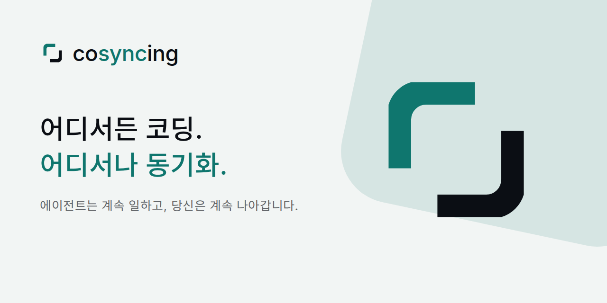

<p align="center">
  <picture>
    <source media="(prefers-color-scheme: dark)"
            srcset="apps/client/assets/brand/source/cosyncing-lockup-stacked-reverse.svg">
    
  </picture>
</p>

<p align="center"><b>CLI에서 GUI까지, 실시간으로 동기화</b></p>

<p align="center">
  <a href="https://cosyncing.com/ko/#sync">
    <picture>
      <source media="(prefers-color-scheme: dark)"
              srcset="https://cosyncing.com/assets/sync/sync-demo-dark.gif">
      
    </picture>
  </a>
</p>

<p align="center">
  <picture>
    <source media="(prefers-color-scheme: dark)"
            srcset="apps/client/assets/brand/marketing/social-banner-ko-1280x640.png">
    
  </picture>
</p>

<p align="center">
  <a href="https://cosyncing.com/ko/">공식 사이트</a> ·
  <a href="#설치">설치</a> ·
  <a href="#클라이언트">클라이언트</a> ·
  <a href="docs/README.md">문서</a> ·
  <a href="docs/CONTRIBUTING.md">기여하기</a> ·
  <a href="README.md">English</a> ·
  <a href="README.zh-CN.md">简体中文</a> ·
  <a href="README.ja.md">日本語</a> ·
  <a href="README.es.md">Español</a>
</p>

---

에이전트를 동기화하고 직접 조작하세요. CLI에서 GUI로, 데스크톱에서 휴대폰으로. 어디에 있든
멈춘 지점에서 그대로 이어갈 수 있습니다. cosyncing은 여러분의 네트워크 안에서 코딩
에이전트를 계속 동기화합니다.

Broker는 에이전트가 실행되는 컴퓨터에서 동작합니다. 각 세션을 지켜보고, 이를 보여 주는
클라이언트를 제공합니다. 세션은 프로젝트별로 묶여 대화 기록, 변경 내용, 명령, 그리고
에이전트가 답을 기다리는 질문까지 함께 표시됩니다. 읽기만 해도 되고, 질문에 답해도 되며,
제어권을 가져올 수도 있습니다. 계정을 만들 필요가 없고, 클라이언트와 Broker 사이에 저희가
운영하는 서비스는 전혀 없습니다.

## 지원 에이전트

<p>
  <a href="https://www.claude.com/product/claude-code" title="Claude Code"></a>
  <a href="https://openai.com/codex/" title="Codex"></a>
  <a href="https://opencode.ai/" title="OpenCode"></a>
  <a href="https://pi.dev/" title="Pi"></a>
  <a href="https://www.kimi.com/code" title="Kimi CLI"></a>
  <a href="https://github.com/deepseek-ai/deepseek-harness" title="DeepSeek Harness"></a>
</p>

일곱 가지 모두를 하나의 프로토콜로 다룹니다. 조작할 수 있는 범위는 에이전트마다 다르며,
Claude Code 세션은 제어권을 가져오기 전까지 읽기 전용으로 열립니다. 버전과 설치 방법은
[지원 에이전트 설정](docs/supported_agents/README.md)을, 기능 대응표는
[어댑터 지원 현황](docs/protocol/adapter-support.md)을 참고하세요.

포그라운드 클라이언트는 네이티브 Resume를 하나 더 띄우지 않고도 Broker가 소유한 같은 Codex 또는
Pi 조작 세션에 참여할 수 있습니다. Claude Code는 다른 클라이언트에서 보기/제어권 가져오기 흐름을
유지하고, OpenCode는 공유 라이브 동작을 유지합니다. 백그라운드 보기 연결은 읽기 전용으로
유지됩니다.

**실험적:** 소스 기여자를 위한 잠정 어댑터가 세 개 있습니다.
[Kimi Code](docs/supported_agents/kimi.md)는 `kimi web` 서버의 모든 세션을 읽기
전용으로 관찰하고, cosyncing이 만든 세션은 직접 조작하며(프롬프트, 승인, 모델 선택), 그렇지 않은
세션은 명시적으로 제어권을 가져옵니다. [DeepSeek Harness](docs/supported_agents/dsh.md)는
`dsh web` 호스트에 연결해, 활성 포그라운드 클라이언트에 공유 대화 기록과 조작 화면을 제공합니다.
모델과 추론 강도 선택, 권한 프리셋, 호스트 자체의 슬래시 명령, 이미지 첨부를 지원합니다. 일반
파일 첨부는 지원하지 않으며(호스트가 이미지만 받습니다), 백그라운드 상주 구독과 일부 메시지
표시는 후속 작업으로 남아 있습니다. [Antigravity](docs/supported_agents/antigravity.md)는
Antigravity CLI 자체의 대화 저장소를 읽고(서버가 없습니다) 모든 대화를 읽기 전용으로 재생하며,
Broker가 소유한 `agy` 자식 프로세스를 통해 조작합니다. 두 클라이언트가 하나의 Drive를 공유할 수
있고, 터미널에서 쓰기가 일어나면 세션을 돌려줍니다.

셋 다 롤아웃 플래그가 필요 없습니다. 서버를 쓰는 두 어댑터는 터미널을 열어 둘 필요도 없습니다. 설치된 cosyncing 서비스가
호스트가 실행 중이 아니면 시작하고, 죽으면 다시 시작하며, 자신이 시작한 것만 중지합니다.
사용자가 직접 시작한 호스트는 중지되거나 교체되거나 재설정되지 않으며, 설정 과정에서 관리에
동의하기 전에 두 호스트의 이름을 모두 알려 줍니다. DeepSeek Harness는
`npm install -g @deepseek-ai/dsh`로 전역 설치하세요. cosyncing은 PATH에서 `dsh`를 찾기 때문에,
`npx`로만 설치하면 통신은 되지만 시작이나 버전 확인은 할 수 없습니다. 두 호스트 모두
[지원 에이전트 설정](docs/supported_agents/README.md)을 참고하세요.

## 사전 요구 사항

서버를 실행하려면 [Bun](https://bun.sh) 1.3.8 이상이 필요하고, 설치와 업데이트에는 Node.js/npm을
사용합니다. Broker는 기본적으로 로컬 전용입니다. 여러 기기에서 쓰려면 프록시, 터널, VPN, 메시
네트워크 등 [운영자가 관리하는 연결 방법](docs/connectivity/README.md)이 필요합니다. 간단한 사설
경로로는 [Tailscale Serve](docs/connectivity/tailscale-serve.md)를, 직접 운영하는 오버레이로는
[WireGuard 또는 EasyTier](docs/connectivity/wireguard-easytier.md)를 참고하세요. `cosyncing setup`
이후에는
`https://github.com/cosyncing/cosyncing/tree/main/docs/connectivity`를 코딩 에이전트에게 넘겨
Broker를 루프백에 묶어 둔 채로 원하는 방법을 설정하게 할 수도 있습니다.
[Tokdash](https://github.com/JingbiaoMei/tokdash)는 선택 사항이지만 사용량 추적과 경고를 위해
강력히 권장합니다.

Linux와 macOS 명령, WSL 관련 참고 사항, Tokdash 설정은
[설치 사전 요구 사항](docs/installation/prerequisites.md)을 참고하세요.

## 설치

패키지에는 JavaScript 애플리케이션 번들 하나와 웹 클라이언트가 들어 있습니다. 지원되는 Broker
호스트는 Linux x64, Linux arm64, Apple Silicon macOS입니다. Windows에서는 WSL 안에서 Broker를
실행하세요.

설정 전에 실제로 쓰는 에이전트만 설치하세요.
[에이전트 설정과 PATH 사전 점검](docs/supported_agents/README.md#preflight)을 참고하세요.

현재 릴리스를 설치합니다:

```bash
npm install --global cosyncing
```

새 로그인 셸을 연 다음 서비스를 설정합니다:

```bash
cosyncing setup

# 설정 후에는 cosy를 cosyncing의 축약형으로 사용합니다
cosy restart
cosy doctor
cosy status
cosy pair
```

`setup`은 컴퓨터를 점검하고, 무엇을 바꿀지 정확히 보여 준 뒤, 계획 전체를 적용하거나 아무것도
적용하지 않습니다. Broker를 `~/.cosyncing/bin/cosyncing`으로 복사하고, 그 복사본을 사용자의 Bun으로
실행하는 사용자 서비스를 설치한 다음, Broker URL을 출력합니다. 설정이 확정되기 전까지 Broker는
시작을 거부합니다.

업데이트하려면 npm이 전역 패키지를 교체하게 한 뒤 setup을 다시 실행해, 새 애플리케이션을 관리
서비스로 옮기고 설치 상태를 정리하세요:

```bash
npm update --global cosyncing
cosy setup
```

`cosy update`는 이 패키지 관리자 기반 업데이트 절차를 안내할 뿐, npm을 실행하거나 전역 패키지를
바꾸지 않습니다.

`cosy pair --broker-url https://cosy.example.com`은 클라이언트가 접근할 수 있는 해당 주소를 5분간
유효한 일회용 QR 코드에 포함합니다. 이 URL은 저장되지도, 접속 확인이 이뤄지지도 않습니다.
클라이언트가 이미 Broker URL을 알고 있다면 플래그를 생략해 인증만 제공하세요.
[연결 방법 선택](docs/connectivity/README.md)을 참고하세요. 클라이언트에서 QR을 스캔하면 접근을
허용합니다. `cosy devices list`로 페어링된 기기를 확인하고, `cosy devices revoke <id>`로 하나를
해지합니다.

설정 후 `cosy doctor`는 컴퓨터를 바꾸지 않고 진단하며, `cosy status`는 설치, 서비스, 에이전트,
세션 상태를 요약합니다.

## 클라이언트

함께 제공되는 Flutter 웹 앱은 여러분의 Broker가 `/cosy/`에서 직접 제공합니다. 실행 중에 제3자
호스트에서 애플리케이션 코드를 가져오지 않습니다. 설정 과정에서 URL이 출력되니, Broker에 접근할 수
있는 브라우저에서 여세요. Android와 데스크톱 클라이언트는
[GitHub Releases](https://github.com/cosyncing/cosyncing/releases/latest)에서 받을 수 있습니다.
iOS 클라이언트는 이후 TestFlight로 제공할 예정입니다.

<p align="center">
  <a href="https://cosyncing.com/ko/demo/">
    <picture>
      <source media="(prefers-color-scheme: dark)"
              srcset="https://cosyncing.com/assets/shots/demo/real/dark/workspace.png">
      
    </picture>
    <picture>
      <source media="(prefers-color-scheme: dark)"
              srcset="https://cosyncing.com/assets/shots/demo/real/dark/sessions.png">
      
    </picture>
  </a>
</p>

**서버** — Broker가 실행되는 환경:

<p>
  
  
  
</p>

**클라이언트** — 소스 트리와 CI가 다루는 여섯 가지 플랫폼:

<p>
  
  
  
  
  
  
</p>

이번 릴리스에서는 Windows 네이티브와 Intel macOS의 서버 호스팅을 지원하지 않습니다. Windows에서는
지원되는 Linux 호스트인 WSL 안에서 Broker를 실행하세요. Broker의 루프백을 전달하는 연결
소프트웨어는 WSL의 Broker에 접근할 수 있는 곳에서 실행해야 합니다. 방법별 가이드를 참고하세요.

## 개인정보와 보안

Broker는 여러분의 컴퓨터에서, 여러분의 계정 권한으로 실행됩니다. Broker 상태는 그곳에 저장되고,
세션 내용은 여러분이 선택한 네트워크를 통해 인증된 클라이언트에만 전송됩니다. 그 연결 경로에
저희가 운영하는 서비스는 없으며, 분석이나 광고 텔레메트리도 포함하지 않습니다. 선택 기능은 명시된
서비스(예: 로컬 Tokdash 사용량 데이터)에만 접속합니다. cosyncing은 연결 사업자를 설정하거나
접속하지 않습니다. 프록시, 터널, VPN, 메시는 모두 운영자가 관리합니다. npm으로 설치한 Broker는
스스로를 조용히 교체하지 않습니다. 패키지 업데이트는 npm이 담당하고, 업데이트 후에는
`cosy setup`이 설치된 서비스를 정리합니다.

취약점은 [SECURITY.md](SECURITY.md)의 절차에 따라 GitHub 비공개 취약점 보고로 알려 주세요.

## 저장소 구조

- `packages/typescript/` — Broker, 와이어 컨트랙트 소유자, 에이전트 어댑터, 전송, 암호화.
- `packages/dart/` — 클라이언트 컨트랙트, 전송, Flutter 어댑터, 암호화.
- `apps/client/` — Flutter 애플리케이션 전체. 각 플랫폼 러너, 테스트 스위트, 통합 드라이버,
  개발 도구를 포함합니다.
- `contracts/generated/` — Broker가 소유하는, 평탄화된 클라이언트 컨트랙트 스냅샷.
- `apps/poc-ui/` — 프로덕션용이 아닌 개념 검증 UI. 결정적 Broker 테스트를 위해 남겨 둡니다.

## 개발

저장소는 `.fvmrc`에 Flutter 3.44.3을, `package.json`에 Bun 1.3.8을 고정합니다. 명령은 저장소
루트에서 실행하세요.

```bash
bun install --frozen-lockfile
bun run client:pub-get
bun run typecheck
bun run client:analyze
bun run client:test
```

Broker가 소유하는 클라이언트 컨트랙트는 `bun run contract:generate`로 다시 만듭니다. CI는
`bun run contract:check`를 실행하며, 스냅샷이 오래되었으면 실패합니다.

[docs/README.md](docs/README.md)와 [build and test](docs/development/build-test.md)부터
시작하세요. 변경을 제안하기 전에 [CONTRIBUTING.md](docs/CONTRIBUTING.md)와
[CODE_OF_CONDUCT.md](docs/CODE_OF_CONDUCT.md)를 읽어 주세요. 기여는 fork + Pull Request 방식이며,
각 커밋에 `git commit -s` 서명이 필요합니다. 사용 관련 질문은 GitHub Discussions로, 재현 가능한
결함은 GitHub Issues로 보내 주세요 — [SUPPORT.md](docs/SUPPORT.md)를 참고하세요. 이전 클라이언트에서
넘어온 설치는 처음 상태로 시작합니다.
[local data and upgrades](docs/development/data-and-upgrades.md)를 참고하세요.
(기여자 문서는 현재 모두 영어입니다.)

## 라이선스

퍼스트파티 소스는 Apache License 2.0으로 제공됩니다. [LICENSE](LICENSE)와 [NOTICE](NOTICE)를
참고하세요.
