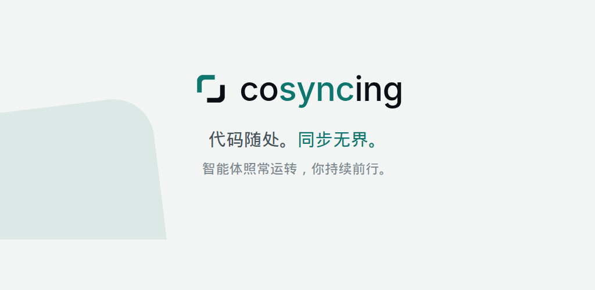

<p align="center">
  <picture>
    <source media="(prefers-color-scheme: dark)"
            srcset="apps/client/assets/brand/source/cosyncing-lockup-stacked-reverse.svg">
    
  </picture>
</p>

<p align="center">
  <b>代码随处。同步无界。</b><br>
  智能体照常运转，你持续前行。
</p>

<p align="center">
  
  
  
</p>

<p align="center">
  <a href="https://cosyncing.github.io/zh/">官网</a> ·
  <a href="#安装">安装</a> ·
  <a href="#网页客户端">网页客户端</a> ·
  <a href="#平台支持">平台支持</a> ·
  <a href="docs/README.md">文档</a> ·
  <a href="CONTRIBUTING.md">参与贡献</a> ·
  <a href="README.md">English</a>
</p>

<p align="center">
  <picture>
    <source media="(prefers-color-scheme: dark)"
            srcset="apps/client/assets/brand/marketing/social-banner-zh-1200x630.png">
    
  </picture>
</p>

---

**代码随处。同步无界。**

让智能体从 CLI 到 GUI、从桌面到手机保持同步。无论身在何处，都能从上次停下的地方继续。
cosyncing 让编码智能体通过你自己的网络保持同步。

Broker 运行在智能体所在的那台机器上，负责观察它们的会话，并提供一个客户端：会话按项目归组，
各自带着完整的对话记录、diff、命令，以及智能体正在等待你回应的提问。你可以阅读会话、回答提问，
或者直接接管。不需要注册账号，客户端与 Broker 之间也不经过我们运营的任何服务。

## 支持的智能体

<p>
  
  
  
  
</p>

四者共用同一套协议；各家智能体开放的能力并不一致，应用会如实显示某个会话实际支持什么。
Claude Code 的会话在接管之前保持只读。逐项能力矩阵见
[adapter support and evidence](docs/protocol/adapter-support.md)（英文）。

## 安装

> [!IMPORTANT]
> 首个公开发行包尚未发布。npm 上当前的 `cosyncing` 条目只是名称占位包，请勿安装。请关注
> [GitHub Releases](https://github.com/cosyncing/cosyncing/releases)，等待首个受支持的发行包。

该发行包是一个自包含的 JavaScript 应用，不内置运行时。请先安装 [Bun](https://bun.sh) 1.3.0 或更高
版本。受支持的 Broker 主机为 Linux x64、Linux arm64 与 Apple Silicon macOS；Windows 上请在 WSL 内
运行 Broker。

首个发行包发布后：

```bash
npm install --global cosyncing
cosyncing setup
cosyncing pair
```

`setup` 会检查这台机器，展示将要做的全部变更，然后要么整体应用、要么完全不动。它把 Broker
复制到 `~/.cosyncing/bin/cosyncing`，安装用户服务（由你的 Bun 运行该副本），并打印你的 Broker
地址。在 setup 提交之前，Broker 拒绝启动。

更新时，先用包管理器更新发行包，再重新运行 setup —— 后者会重新复制新的应用并协调服务：

```bash
npm update --global cosyncing
cosyncing setup
```

`pair` 打印一张五分钟内有效、一次性的配对二维码。用客户端扫码即可授权该设备；
`cosyncing devices list` 列出已配对设备，`cosyncing devices revoke <id>` 撤销指定设备。

动手之前还有两个有用的命令：`cosyncing doctor` 只诊断、不改动机器；`cosyncing status`
汇总安装、服务、智能体与会话的状态。

## 网页客户端

发行包内的 Flutter 网页应用由你自己的 Broker 在 `/cosy/` 提供；运行时不会从第三方主机
拉取应用代码。setup 会打印访问地址；任何能连到 Broker 的浏览器都可以打开。首批 Android
与桌面客户端发行包仍在准备中。

## 平台支持

**Broker 宿主机**

<p>
  
  
</p>

**客户端** — 源码与 CI 覆盖六个平台：

<p>
  
  
  
  
  
  
</p>

本版本不支持原生 Windows 与 Intel 芯片 Mac 作为 Broker 宿主机。Windows 上请在 WSL 内运行
Broker——WSL 属于受支持的 Linux 宿主机；Tailscale 也要装在 WSL 内，因为 Windows 侧的
Tailscale 无法代理 WSL 的回环地址。

## 隐私与安全

Broker 由你运行，跑在你自己的机器和账号下。Broker 状态存储在那台机器上；会话内容只会通过
你选择的网络发送给已认证的客户端。cosyncing 不在连接路径中运营托管服务，也不含分析或广告
遥测。可选功能只会联系其明确说明的服务，例如 Tailscale Serve、本机 Tokdash 配额数据与签名
发行通道。发行版 Broker 只接受经过验证的签名清单；见
[broker release and signing](docs/release/broker-release-signing.md)（英文）。

安全漏洞请通过 GitHub 私密漏洞报告提交，流程见 [SECURITY.md](SECURITY.md)。

## 仓库结构

- `packages/typescript/` — Broker、线上契约的所有者、智能体适配器、传输与加密包。
- `packages/dart/` — 客户端契约、传输、Flutter 适配器与加密包。
- `apps/client/` — 完整的 Flutter 应用，含全部平台 runner、测试套件、集成驱动与开发工具。
- `contracts/generated/` — 由 Broker 拥有、扁平化的客户端契约快照。
- `apps/poc-ui/` — 非生产的概念验证 UI，保留用于确定性的 Broker 测试。

## 开发

仓库在 `.fvmrc` 固定 Flutter 3.44.3，在 `package.json` 固定 Bun 1.3.8。命令一律在仓库根
目录执行。

```bash
bun install --frozen-lockfile
bun run client:pub-get
bun run typecheck
bun run client:analyze
bun run client:test
```

用 `bun run contract:generate` 重新生成 Broker 拥有的客户端契约。CI 运行
`bun run contract:check`，快照过期即失败。

入口文档是 [docs/README.md](docs/README.md) 与
[build and test](docs/development/build-test.md)。提交改动前请阅读
[CONTRIBUTING.md](CONTRIBUTING.md) 与 [CODE_OF_CONDUCT.md](CODE_OF_CONDUCT.md)；贡献采用
fork + Pull Request 流程，每个提交需要 `git commit -s` 签署。使用问题走 GitHub
Discussions，可复现的缺陷走 GitHub Issues——见 [SUPPORT.md](SUPPORT.md)。从前代客户端
迁移的安装会重新开始，见 [local data and upgrades](docs/development/data-and-upgrades.md)。
（贡献者文档目前均为英文。）

## 许可证

第一方源代码以 Apache License 2.0 授权。见 [LICENSE](LICENSE) 与 [NOTICE](NOTICE)。
